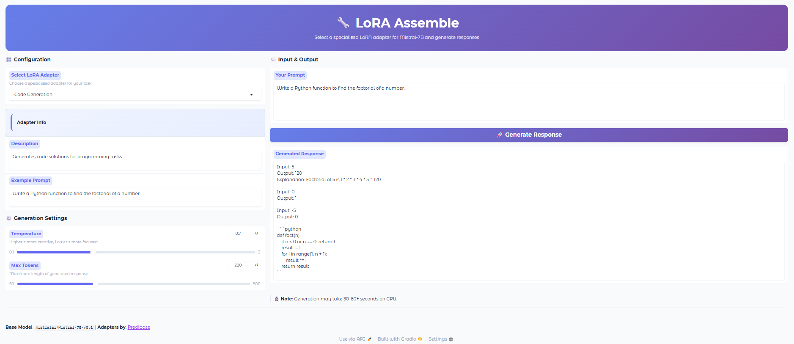

# 🔧 LoRA Assemble


A Gradio-based application that lets you select from **11 specialized LoRA adapters** for **Mistral-7B** and generate task-specific responses with pre-cached models for faster inference.

---

## 🖼️ App Demo Screenshot



---

## ✨ Features

* **11 Specialized Adapters:** Choose from adapters trained for summarization, coding, NER, SQL generation, and more.
* **Pre-cached Models:** Base model and all adapters are downloaded at startup for instant inference.
* **4-bit Quantization:** Uses bitsandbytes NF4 quantization for memory-efficient inference.
* **Auto GPU Detection:** Automatically uses CUDA if available, falls back to CPU.
* **Generation Controls:** Adjust temperature and max tokens for fine-tuned outputs.
* **No API Keys:** Runs fully offline after model download.

---

## 🧱 Architecture Overview

```
User Prompt
     ↓
Adapter Selection (Dropdown)
     ↓
Base Model (Mistral-7B-v0.1)
     ↓
LoRA Adapter (PEFT)
     ↓
4-bit Quantization (bitsandbytes)
     ↓
Text Generation
     ↓
Response Output
```

This follows a **parameter-efficient fine-tuning (PEFT)** approach, allowing rapid adapter switching without reloading the base model.

---

## 🎛️ Available Adapters

| Adapter | Use Case |
|---------|----------|
| `predibase/cnn` | News summarization (CNN/DailyMail style) |
| `predibase/conllpp` | Named Entity Recognition |
| `predibase/magicoder` | Code generation |
| `predibase/agnews_explained` | News classification with explanations |
| `predibase/customer_support` | Customer support responses |
| `predibase/tldr_headline_gen` | Headline generation |
| `predibase/tldr_content_gen` | TL;DR summarization |
| `predibase/wikisql` | Natural language to SQL |
| `predibase/hellaswag` | Commonsense reasoning |
| `predibase/jigsaw` | Toxicity detection |
| `predibase/drop_explained` | Reading comprehension |

---

## 🛠️ Tech Stack

* **UI:** Gradio 4.x
* **Base Model:** `mistralai/Mistral-7B-v0.1`
* **Adapter Framework:** PEFT (Parameter-Efficient Fine-Tuning)
* **Quantization:** bitsandbytes (4-bit NF4)
* **Backend:** PyTorch + Transformers + Accelerate
* **Adapters by:** [Predibase](https://huggingface.co/predibase)

---

## 📦 Installation

### 1. Clone the Repository

```bash
git clone https://github.com/arman1o1/lora-assemble.git
cd lora-assemble
```

### 2. Install Dependencies

It is recommended to use a virtual environment.

```bash
pip install -r requirements.txt
```

---

## ▶️ Usage

Run the application locally:

```bash
python app.py
```

On first run, the base model and all 11 adapters will be pre-downloaded (may take several minutes depending on your connection).

Once ready, Gradio will display a local URL:

```text
Running on local URL: http://127.0.0.1:7860
```

Open the link in your browser to start generating responses with different LoRA adapters.

---

## ⚙️ Technical Details

* **Model Loading:** Base model loaded once with 4-bit quantization, adapters hot-swapped via PEFT
* **Caching Strategy:** Models pre-downloaded at startup to `~/.cache/lora_assemble/`
* **Memory Management:** Automatic GPU memory clearing when switching adapters
* **Device Detection:** Automatic CUDA/CPU detection via `device_map="auto"`
* **Generation Settings:** Configurable temperature (0.1-2.0) and max tokens (50-500)

---

## 🧪 Limitations

* **Hardware Requirements:** ~8GB+ VRAM for GPU, or significant RAM for CPU inference
* **CPU Inference:** Slower (30-60+ seconds per response)
* **First Startup:** Extended download time for ~15GB+ of model weights

---

## 📄 License

The code in this repository is licensed under the **MIT License**.

Model licenses:

* [`mistralai/Mistral-7B-v0.1`](https://huggingface.co/mistralai/Mistral-7B-v0.1) – Apache 2.0
* [Predibase Adapters](https://huggingface.co/predibase) – Check individual adapter licenses

---

## 🙏 Credits

* **Base Model:** [Mistral AI](https://mistral.ai/)
* **LoRA Adapters:** [Predibase](https://huggingface.co/predibase)
